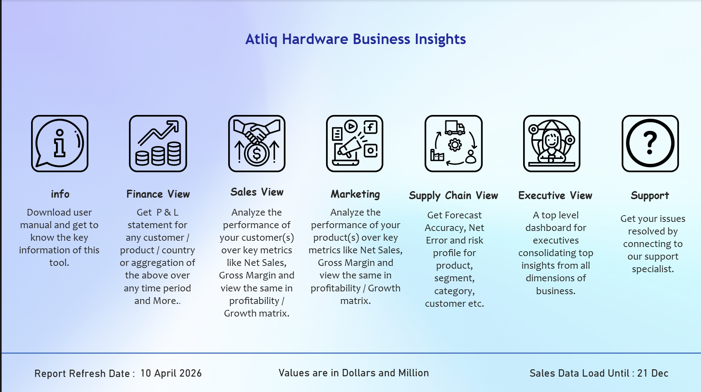
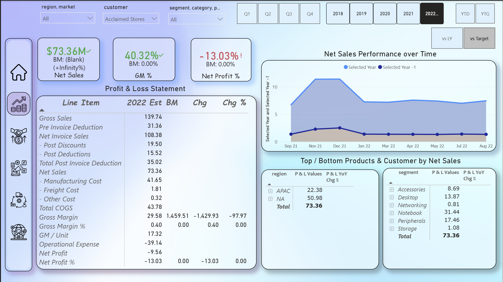
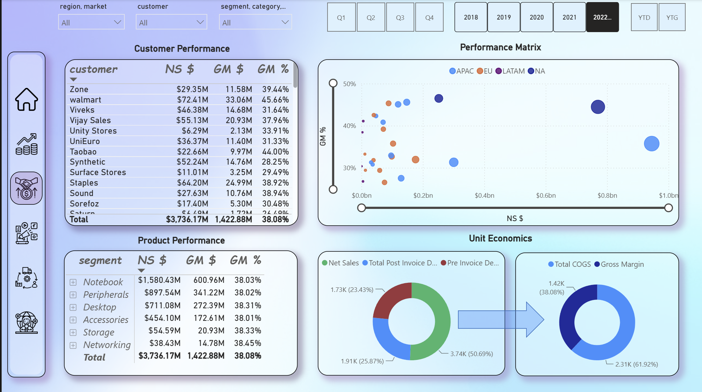
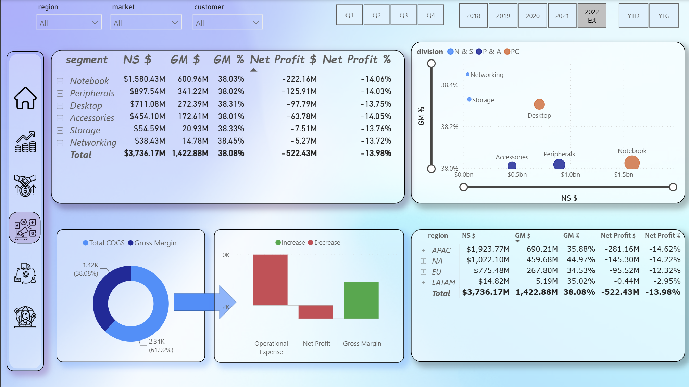
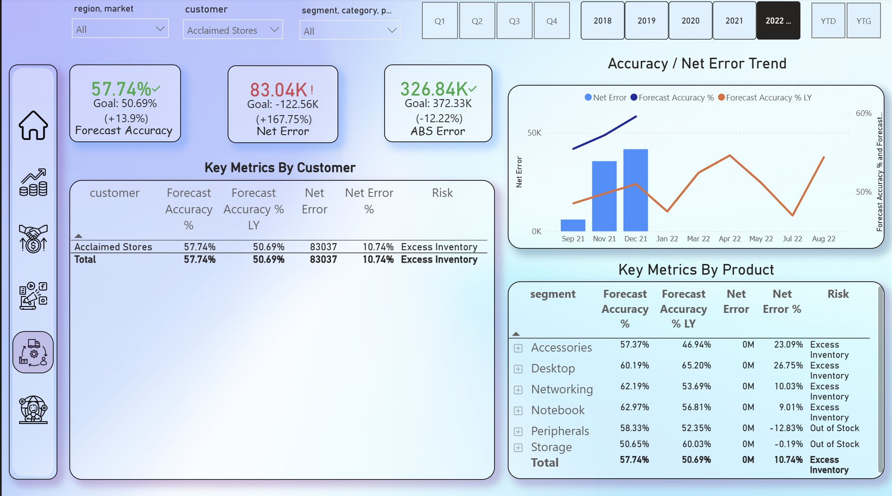

# Power BI Business Analytics Dashboard

## 📊 Project Overview

This Power BI project presents an interactive business analytics dashboard designed to analyze performance across **Finance, Sales, Marketing, and Supply Chain** functions.

The report combines multiple business dimensions and fact tables into a centralized analytical model, enabling users to monitor KPIs, identify trends, compare performance, and drill into business drivers.

## 🎯 Business Objectives

The dashboard is designed to help business stakeholders:

- Monitor overall business and financial performance
- Analyze sales performance across products, customers, and markets
- Evaluate marketing performance and key business drivers
- Track supply-chain related metrics and operational performance
- Compare actual performance against relevant targets or benchmarks
- Identify trends, opportunities, and areas requiring attention
- Provide an interactive reporting layer for business decision-making

## 🛠️ Tools & Technologies

- **Microsoft Power BI**
- **Power Query** – data extraction and transformation
- **DAX** – calculated measures and analytical logic
- **Data Modeling** – relationships between fact and dimension tables
- **Power BI Visualizations** – interactive charts, KPI cards, tables, and filters

## 📸 Dashboard Screenshots

### Home Dashboard



### Finance Dashboard



### Sales Dashboard



### Marketing Dashboard



### Supply Chain Dashboard



## 🗂️ Report Structure

The PBIX contains multiple report pages covering different analytical areas, including:

| Area | Purpose |
|---|---|
| Finance | Financial and profitability analysis |
| Sales | Sales performance and business trends |
| Marketing | Marketing-related performance analysis |
| Supply Chain | Operational and supply-chain analysis |
| Business KPIs | High-level performance monitoring |
| Detailed Analysis | Drill-down and supporting analysis |

The report uses interactive filters and cross-filtering to allow users to move from high-level KPIs into more detailed business views.

## 🧩 Data Model

The report follows a structured analytical data model containing:

- **Fact tables** for transactional/business performance data
- **Dimension tables** for descriptive attributes such as products, customers, markets, and other business entities
- A dedicated **`Report Measure`** layer for reusable DAX measures
- Relationships between fact and dimension tables to support slicing and aggregation

This structure helps keep analytical calculations centralized and makes the report easier to maintain.

## 📐 DAX & Measures

The project uses DAX measures to calculate and analyze business KPIs rather than relying only on raw columns.

The measure layer supports calculations such as:

- Revenue / Sales
- Costs and profitability
- Performance comparisons
- Aggregations across business dimensions
- KPI calculations
- Time-based analysis
- Business-specific analytical metrics

Centralizing measures improves consistency across report pages and allows the same business logic to be reused throughout the dashboard.

## 🔄 Data Transformation

Power Query is used as part of the data preparation process to transform source data before it reaches the analytical model.

Typical transformation activities include:

- Cleaning source data
- Formatting and standardizing columns
- Handling data types
- Preparing dimension attributes
- Preparing fact-table data
- Creating a model suitable for reporting and analysis

## 📈 Dashboard Capabilities

The report provides interactive analytical capabilities including:

- KPI monitoring
- Trend analysis
- Category/product analysis
- Customer/market analysis
- Cross-filtering between visuals
- Drill-down analysis
- Interactive slicers and filters
- Detailed tabular analysis

These capabilities allow users to move from an executive-level overview to more granular analysis.

## 🔍 Key Analytical Questions

The dashboard can be used to answer questions such as:

1. How is overall business performance changing over time?
2. Which products or categories are driving sales?
3. Which customers or markets contribute most to performance?
4. Where are profitability opportunities or weaknesses?
5. How are marketing activities performing?
6. Which supply-chain areas require attention?
7. What business segments are contributing positively or negatively to overall performance?

## 📁 Repository Structure

```text
Power-BI-Business-Analytics/
│
├── README.md
│
├── PowerBI/
│   └── chapter_7_Power_BI.pbix
│
├── Dataset/
│   └── source-data
│
├── Screenshots/
│   └── dashboard-screenshots
│
└── Documentation/
    └── data-model
```

## 🚀 How to Use

1. Install **Microsoft Power BI Desktop**.
2. Clone or download this repository.
3. Open the `.pbix` file using Power BI Desktop.
4. Review the report pages and interact with the filters/slicers.
5. If the source data is external, update the data-source configuration as required.
6. Refresh the model to load the latest available data.

## ⚠️ Notes

- The `.pbix` file is a Power BI Desktop project and is intended to be opened with Power BI Desktop.
- Dataset availability and refresh behavior depend on the configured data sources.
- Sensitive credentials or connection information should **not** be committed to GitHub.
- For better source-control support, the project can be converted to the **PBIP** format, which stores report/model definitions as files rather than keeping everything inside a single binary PBIX file.

## 📌 Project Highlights

This project demonstrates practical experience with:

- Power BI dashboard development
- Data modeling
- Power Query
- DAX
- KPI development
- Business intelligence reporting
- Interactive data visualization
- Multi-functional business analysis
- Analytical storytelling

## 👤 Author

**Tanmay Ghosh**

Built as a Power BI business analytics project showcasing data modeling, DAX, visualization, and business intelligence skills.